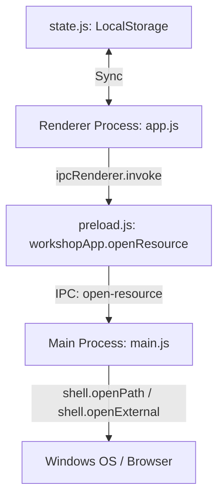

# Design Spec: 프로젝트 아카이브 탭 및 구조지도 노드 통합 연동

이 스펙은 프로젝트에 필요한 로컬 파일 경로, 폴더, 그리고 외부 웹 주소(Figma, Notion 등)를 손쉽게 저장하고, 원클릭으로 탐색기나 브라우저에서 실행할 수 있도록 하는 **아카이브 탭(상세 패널) 및 아카이브 노드(구조지도)** 통합 설계 사양을 정의합니다.

---

## 1. 요구사항 및 주요 시나리오

1. **상세 패널 내 [아카이브] 탭 (A안)**
   * 상세 패널의 뷰 스위처에 '아카이브'를 추가해 **[상세 | 그래프 | 아카이브]** 3대 탭을 제공합니다.
   * 리소스 타입: `로컬 파일(File)`, `로컬 폴더(Folder)`, `웹 링크(Web Link)`
   * 간편 리소스 등록 폼 및 삭제 기능을 제공합니다.
2. **구조지도 내 [아카이브 노드] (C안)**
   * 캔버스 우클릭 메뉴를 통해 단독 '아카이브 노드'를 생성할 수 있습니다.
   * 아카이브 노드도 일반 노드처럼 드래그해 이동시키거나, 연결선(SVG)을 통해 특정 **프로젝트 또는 할 일 노드**에 점선 연결을 맺을 수 있습니다.
3. **할 일 노드와의 유기적 연동 (통합안 1순위)**
   * 구조지도 상에서 특정 할 일 노드에 아카이브 노드가 연결되면, 할 일 카드 내 하단에 해당 리소스 바로가기 **미니 배지**가 노출되어 즉시 클릭-실행이 가능합니다.
   * 할 일의 **메모 모달** 상세 뷰 안에서도 연결된 리소스 목록이 나열되어, 세부 경로를 확인하고 실행할 수 있습니다.
4. **로컬 파일 / 폴더 실행**
   * 로컬 리소스 열기 클릭 시, Electron Native Shell API를 호출해 탐색기에서 폴더를 오픈하거나 기본 연결 프로그램으로 파일을 직접 구동합니다.

---

## 2. 시스템 아키텍처 및 데이터 흐름



### 데이터 스키마 정의
* **프로젝트 리소스**: `project.resources` 배열로 보관
  ```typescript
  interface ProjectResource {
    id: number;
    name: string;
    type: 'file' | 'folder' | 'link';
    path: string; // 로컬 절대경로 또는 URL
  }
  ```
* **구조지도 아카이브 노드 & 링크**: `state.appSettings` 하위에 저장
  ```typescript
  interface ArchiveNode {
    id: number;
    title: string;
    type: 'file' | 'folder' | 'link';
    path: string;
    x: number;
    y: number;
  }
  
  interface ArchiveLink {
    id: string; // format: "archive:sourceId:targetType:targetId"
    sourceId: number; // archiveNode id
    targetType: 'project' | 'task';
    targetId: number;
  }
  ```

---

## 3. 컴포넌트별 상세 변경 사항

### A. Electron Bridge (`main.js` & `preload.js`)
* `main.js`:
  - `const { shell } = require("electron");` 임포트
  - IPC 핸들러 `open-resource` 구현:
    * `type === 'link'` 또는 `path`가 `http://` / `https://` 로 시작하면 `shell.openExternal(path)` 호출
    * 로컬 파일/폴더 경로인 경우 `shell.openPath(path)` 호출
* `preload.js`:
  - `workshopApp.openResource(path, type)` 노출

### B. 상태 관리 (`state.js`)
* `state` 객체에 `appSettings.graphArchiveNodes` 및 `appSettings.graphArchiveLinks` 관리 필드 추가
* 데모 마이그레이션 실행 시 병목 진단 테스트(id 9) 프로젝트에 예시 아카이브 리소스와 노드를 인젝트하여 즉시 테스트 가능하도록 지원

### C. UI 컴포넌트 (`ui-components.js` & `app-modals.js`)
* `renderViewSwitch()`: `archive` 탭 스위치 단추 추가
* `renderArchiveView(project)` [NEW]: 아카이브 전용 뷰 렌더러 구현 (리소스 CRUD 인풋 및 목록 카드 렌더링)
* `taskCardMarkup()`: 해당 할 일 노드에 꽂힌 아카이브 목록을 쿼리하여 하단에 미니 실행 배지 렌더링
* `noteModal` 마크업 개편: 메모 모달 하단에 연결된 아카이브 리소스 리스트 및 바로가기 열기 추가

### D. 구조지도 컴포넌트 (`graph-components.js`)
* `buildGraphData()`: 아카이브 노드(`type: "archive"`)와 아카이브 링크(`type: "archiveLink"`) 데이터 연계 처리
* `renderGraphView()`: 아카이브 노드 섀시 및 포트 렌더링 연동
* 콘텍스트 메뉴에 `아카이브 노드` 추가 항목 배치

### E. 코어 및 이벤트 핸들러 (`app.js` & `app-graph-events.js`)
* `app.js`: 
  - `openResource()`, `addArchiveResource()`, `deleteArchiveResource()` 등 비즈니스 코어와 렌더 갱신 연동
* `app-graph-events.js`:
  - 아카이브 탭 리소스 추가/삭제/열기 버튼 및 폼 클릭 바인딩
  - 할 일 미니 아카이브 배지 클릭 시 즉시 오픈되도록 바인딩
  - 캔버스 내 아카이브 노드의 '리소스 열기' 버튼 클릭 시 openResource 호출 연동
  - 아카이브 노드 캔버스 드래그 및 연결선 포트 바인딩 연동

---

## 4. 검증 계획 (Verification Plan)

### A. 기능 및 동작성 검증
* 웹 링크 등록 후 `[열기]` 클릭 시 브라우저에서 올바른 URL이 뜨는지 확인
* 로컬 폴더(예: `C:\Users`) 등록 후 `[열기]` 클릭 시 탐색기 창이 정상 구동되는지 확인
* 구조지도 상에서 아카이브 노드 드래그 앤 드롭으로 할 일 카드에 연결선이 칼같이 달라붙고 카드 하단에 미니 배지가 갱신되는지 확인
* 할 일을 더블클릭해 연 "메모 모달"에서도 아카이브가 안전하게 노출되는지 확인

### B. 안정성 및 구문 검사
* `node --check`를 통한 모든 JS 파일의 구문 무결성 확보
* `package.json` 패키지 구성 점검
