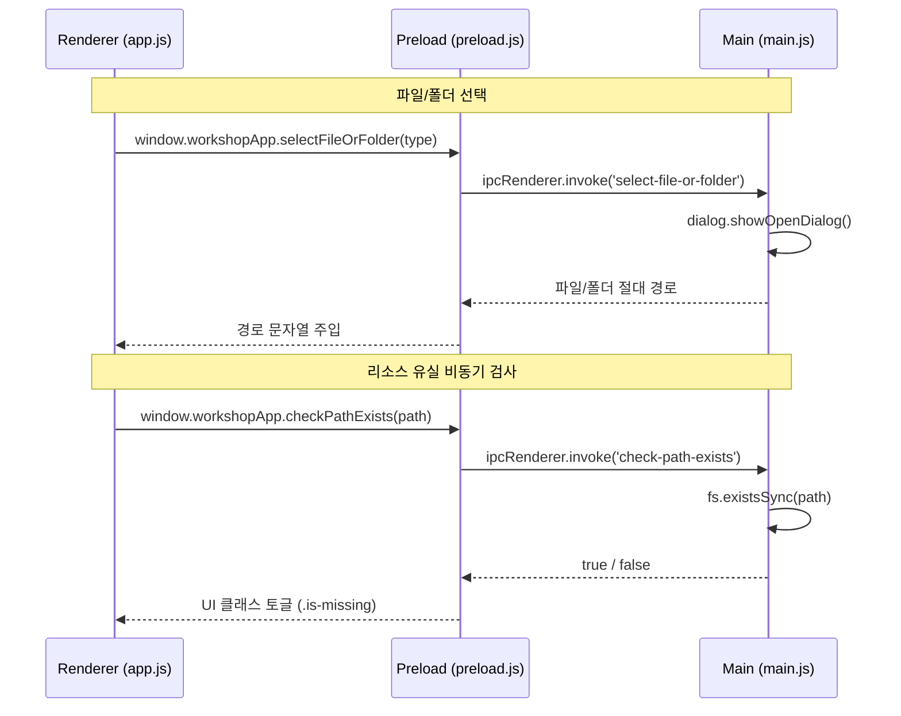

# 설계 문서: 로컬 파일 브릿지 및 유실 감지 시스템

본 문서는 아카이브(리소스) 시스템과 로컬 OS(윈도우 탐색기 및 파일 시스템) 간의 생산성 연동을 고도화하기 위한 설계 명세입니다. 

---

## 1. 개요 및 사용자 흐름

1. **로컬 파일/폴더 네이티브 등록**:
   - 아카이브 추가 및 수정 영역에 [파일], [폴더] 선택 단추를 배치합니다.
   - 단추 클릭 시 OS 파일 선택창이 뜨고, 경로가 자동으로 입력창에 주입됩니다.
   - 기존의 파일 드래그 앤 드롭(Drag & Drop) 등록 방식은 그대로 유지됩니다.

2. **로컬 파일 브릿지 (실행)**:
   - 아카이브 목록 또는 상세 패널 내 카드에서 [열기] 버튼 클릭 시, Electron `shell.openPath` 또는 `shell.openExternal`을 활용해 연결된 프로그램으로 즉시 실행됩니다.

3. **로컬 리소스 유실 감지 (유효성 검증)**:
   - 리스트 렌더링 이후 백그라운드에서 파일 존재 여부(`fs.existsSync`)를 검증하여, 파일이 지워졌거나 옮겨졌을 때 카드 레이아웃에 경고(⚠️ [유실됨]) 및 비활성화를 시각적으로 부여합니다.

---

## 2. 시스템 아키텍처 및 IPC 채널 설계

보안 지침(Context Isolation)에 따라, 메인 프로세스와 렌더러 프로세스는 IPC 통신을 통해서만 연동됩니다.



### IPC 채널 상세 명세

1. **`select-file-or-folder`**
   - **요청 매개변수**: `type` ("file" | "folder")
   - **반환값**: `string | null` (선택된 파일/폴더의 절대 경로 또는 취소 시 `null`)
   - **설명**: `dialog.showOpenDialog`를 실행하여 단일 경로를 획득합니다.

2. **`check-path-exists`**
   - **요청 매개변수**: `filePath` (`string`)
   - **반환값**: `boolean` (존재 시 `true`, 부재 시 `false`)
   - **설명**: `http://` 또는 `https://` 로 시작하는 웹 링크는 항상 `true`를 반환하며, 로컬 경로는 `fs.existsSync` 결과값을 반환합니다.

---

## 3. 파일 변경 명세 (Proposed Changes)

### 3.1. [MODIFY] [main.js](file:///c:/Users/USER/Documents/Codex/2026-05-22/1-2-ui-3-4/main.js)
- `select-file-or-folder` IPC 핸들러 구현.
- `check-path-exists` IPC 핸들러 구현.

### 3.2. [MODIFY] [preload.js](file:///c:/Users/USER/Documents/Codex/2026-05-22/1-2-ui-3-4/preload.js)
- `workshopApp` 객체에 `selectFileOrFolder`, `checkPathExists` 래퍼 함수 추가.

### 3.3. [MODIFY] [ui-components.js](file:///c:/Users/USER/Documents/Codex/2026-05-22/1-2-ui-3-4/ui-components.js)
- `renderArchiveView` 함수 내 신규 리소스 추가 폼(`addArchiveForm`) 마크업 변경: 경로 입력란 옆 파일/폴더 선택 버튼 추가.
- `renderArchiveView` 내 리소스 카드별 수정 폼(`data-edit-archive-form`) 마크업 변경: 동일하게 파일/폴더 선택 아이콘 버튼 추가.
- 리소스 행 마크업(`archive-resource-row`)에 검사 식별용 클래스 `js-archive-item`과 `data-resource-id`, `data-resource-path` 속성 부여.

### 3.4. [MODIFY] [app.js](file:///c:/Users/USER/Documents/Codex/2026-05-22/1-2-ui-3-4/app.js)
- 아카이브 리스트 렌더링 직후 실행될 유효성 검사 함수 `scanArchivePaths()` 구현:
  ```javascript
  export async function scanArchivePaths(container = document) {
    const items = container.querySelectorAll(".js-archive-item");
    for (const item of items) {
      const path = item.getAttribute("data-resource-path");
      if (!path) continue;
      const exists = await window.workshopApp.checkPathExists(path);
      item.classList.toggle("is-missing", !exists);
    }
  }
  ```
- 메인 아카이브 뷰 전환 시(`renderArchiveView` 호출 직후) 및 상세 패널 전환 시(`scanArchivePaths` 호출) 해당 유효성 검사가 작동하도록 연동.

### 3.5. [MODIFY] [app-graph-events.js](file:///c:/Users/USER/Documents/Codex/2026-05-22/1-2-ui-3-4/app-graph-events.js)
- 신규 등록 및 수정 폼의 [파일/폴더 선택] 버튼 클릭 시 `workshopApp.selectFileOrFolder`를 연동하여 입력 필드 값을 업데이트하는 이벤트 핸들러 바인딩.

### 3.6. [MODIFY] [components.css](file:///c:/Users/USER/Documents/Codex/2026-05-22/1-2-ui-3-4/components.css)
- `.archive-resource-row.is-missing` 스타일 규칙 추가: 경고 헤더 추가(`⚠️ [유실됨]`), 투명도 조절, 비활성화 효과 부여.

---

## 4. 예외 및 코너 케이스 처리

1. **상대 경로 및 환경 변수 처리**:
   - 사용자가 직접 타이핑한 잘못된 형식의 경로나 상대 경로는 존재하지 않는 파일로 안전하게 감지되어 유실 처리(`is-missing`)됩니다.
2. **비동기 렌더링 병목 차단**:
   - 한 번에 대량의 리소스 유효성을 검사할 때 순차적인 `await`로 인한 지연을 막기 위해 `Promise.all` 기반의 병렬 검사(Batch check) 방식으로 `scanArchivePaths`를 최적화 구현합니다.
3. **네이티브 다이얼로그 취소**:
   - 파일 선택 창을 띄웠다가 사용자가 '취소'를 눌렀을 때는 기존 텍스트 박스의 입력값을 덮어쓰지 않고 원본을 유지합니다.

---

## 5. 검증 계획 (Verification Plan)

### 수동 검증 절차
1. **파일/폴더 선택 테스트**:
   - 아카이브 탭 하단 폼에서 [📁 파일] 버튼을 클릭해 정상적으로 윈도우 파일 다이얼로그가 뜨는지 확인.
   - 특정 파일을 선택했을 때 텍스트 박스에 절대 경로가 채워지는지 확인.
   - 추가된 리소스의 [열기] 버튼을 눌렀을 때 해당 파일이 PC에서 정상 오픈되는지 확인.
2. **유실 상태 테스트**:
   - 임의의 가짜 파일 경로(예: `C:\invalid\path.txt`)를 등록하여 화면에 `⚠️ [유실됨]` 빨간 딱지가 붙고, [열기] 버튼이 비활성화되는지 확인.
   - 실제로 존재하는 파일(예: 메모장으로 만든 `test.txt`)을 등록하여 정상 활성화된 것을 확인한 뒤, 윈도우 탐색기에서 해당 파일을 삭제한 후 아카이브 화면을 새로고침(탭 전환)했을 때 `⚠️ [유실됨]`으로 동적 변경되는지 확인.
